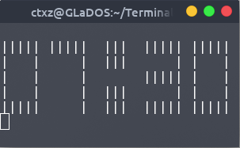

# Terminal Clock

This is a horrible piece of code written only due to a student request on my C++ courses. If however you are so interested you may go ahead and install this CEST only Digital Clock Simulation in the terminal

# How to install

Start out by cloning this repository

```
git clone https://github.com/CTXz/Terminal-Clock.git
```

Next cd into the repository

```
cd Terminal-Clock
```

Now build the application
```
make
```

And finally, install it
```
sudo make install
```

# Executing The Application

Simply enter

```
TermClock 
```
into the terminal




